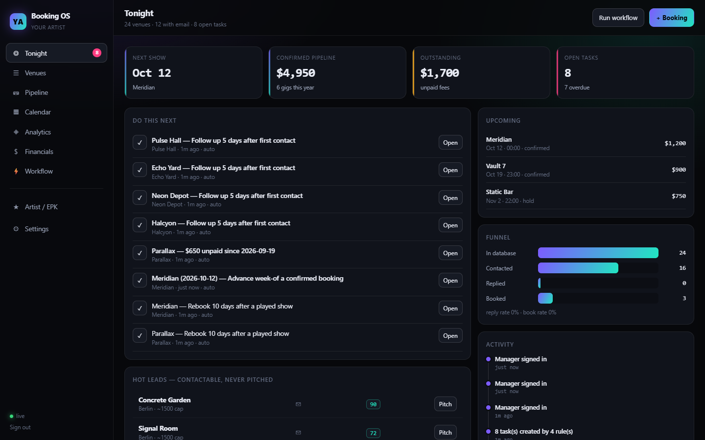
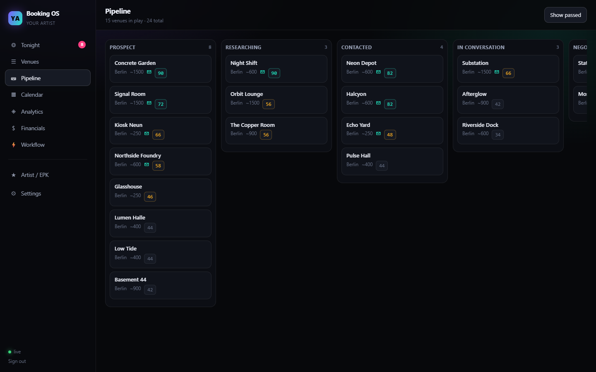
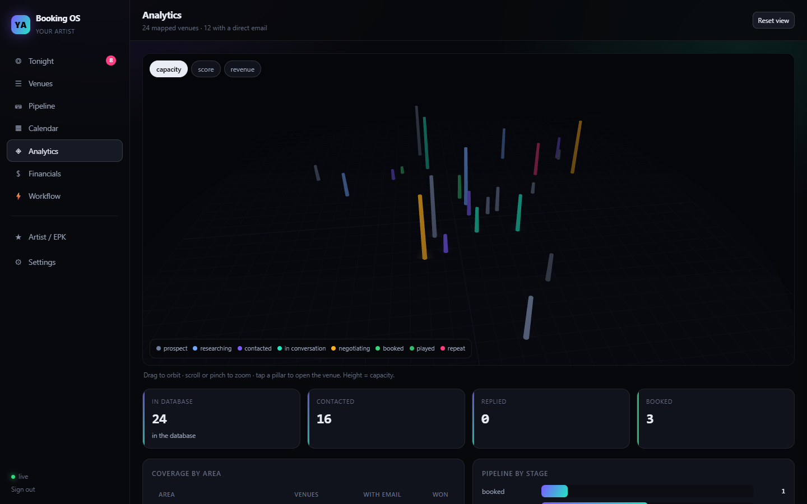
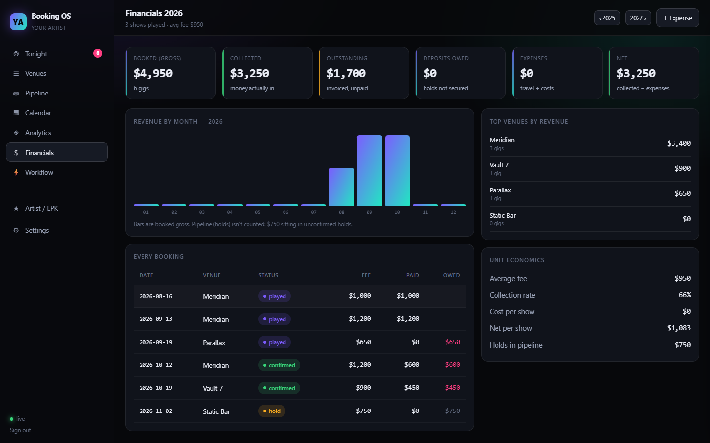
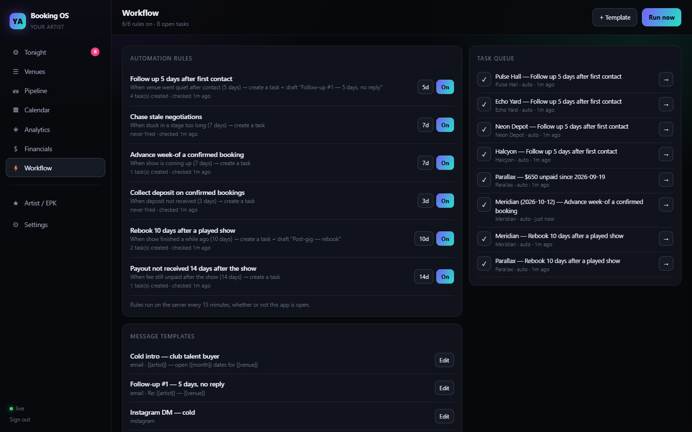
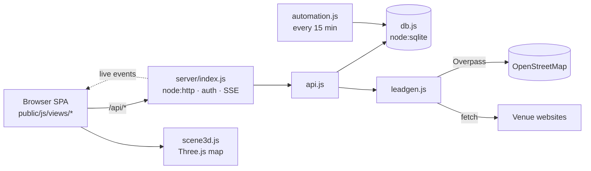

# booking-os

A booking CRM for DJ and artist managers. It finds venues, tracks the pipeline, books dates,
chases the money and writes the follow-ups. Zero npm dependencies.



## What's in it

| View | What it does |
|---|---|
| **Tonight** | Next show, tasks the workflow rules created, hot leads nobody has pitched yet, the funnel and a live activity feed |
| **Venues** | Every venue with contacts and a lead score. Filter by stage, area or whether it can be contacted. CSV export. |
| **Pipeline** | Nine-stage board from prospect to repeat client. Drag on desktop, long-press on a phone. |
| **Calendar** | Month grid and agenda. Holds, confirmations, played and cancelled. |
| **Analytics** | A 3D map. Every venue is a pillar at its real position, coloured by stage, with height showing capacity, lead score or revenue. |
| **Financials** | Booked, collected, outstanding, deposits owed, expenses, net, revenue per venue, unit economics. |
| **Workflow** | Six automation rules and message templates with merge fields. The rules run on the server every 15 minutes. |
| **Artist / EPK** | The artist profile, a Spotify embed and copy-paste pitch text. |

<p>


</p>
<p>


</p>

## The lead generator

**Venues → Find venues** asks OpenStreetMap for nightclubs, dance venues, event spaces and
music bars in each area you configure. It then reads each venue's own website (home,
`/contact`, `/booking`, `/private-events`) for booking emails, phone numbers and socials.
`booking@` and `talent@` addresses rank above `info@`.

**It never invents a contact.** If a site blocks the request or is a JavaScript shell, the
field stays empty and the venue is marked as needing research. A phone number has to appear
with real separators, or in a `tel:` link, to count.

Re-running a sweep refreshes contact details without touching a venue's stage or notes.

Areas live in `config/areas.json`. Copy the example and add your own bounding boxes
(`[south, west, north, east]`):

```bash
cp config/areas.example.json config/areas.json
```

## Workflow rules

All six are editable in **Workflow**, and they're idempotent, so a rule never queues the same
task twice:

1. Follow up 5 days after first contact
2. Chase negotiations stuck for 7 days
3. Advance a confirmed show the week before
4. Collect deposits on confirmed bookings
5. Send the rebook note 10 days after a played show
6. Invoice when a payout is 14 days late

Templates fill in `{{venue}}`, `{{contact_first}}`, `{{artist}}`, `{{month}}`, `{{date}}`,
`{{fee}}`, `{{deposit}}`, `{{home_base}}` and more from the venue, the booking and the artist
profile.

## Run it

Needs Node 22 or newer (it uses the built-in `node:sqlite`).

```bash
cp .env.example .env
node --env-file=.env server/index.js     # http://localhost:3007
```

No `npm install`. The first boot seeds **fictional demo data**: 24 made-up venues across the
example areas, six bookings and the default rules and templates. The rules create their first
tasks straight away. Set `DEMO_SEED=0` to start empty.

Sign in as `manager@example.com` / `changeme2026`, or set `ADMIN_EMAIL` and `ADMIN_PASSWORD`
before the first boot. Then fill in **Artist / EPK**.

With Docker:

```bash
docker build -t booking-os .
docker run -p 3007:3007 -v booking-data:/app/data --env-file .env booking-os
```

## How it's built



- **No dependencies.** `node:http` and `node:sqlite` on the server, Three.js vendored for
  the map.
- **Live updates.** Server-sent events push new tasks and activity to every open tab.
- **Installable.** A manifest and service worker let it work as a home-screen app.

## License

MIT. Built by [Dime Data](https://dimedata.cloud). Three.js is MIT, © its authors.
